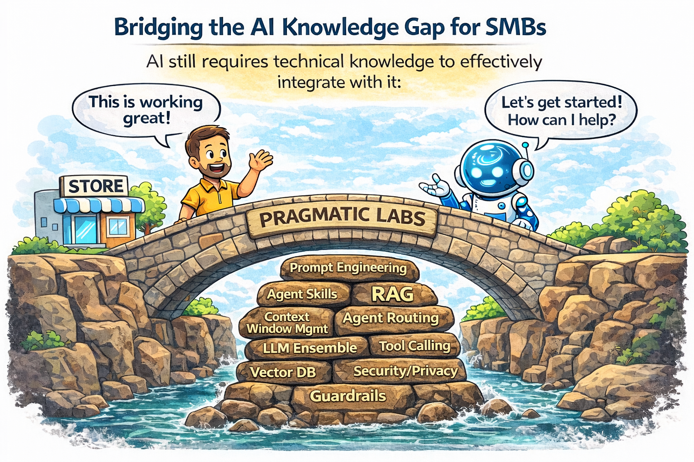

<!-- SLIDES: lean text · big visuals · image placeholders -->

<!-- ─── SLIDE 1 — TITLE ─────────────────────────────────── -->

  

    neural
    LLM
    embedding
    transformer
    inference
    prompt
    agent
    token
    rag
    context
    vector
    attention
    encoder
    decoder
    weights
    gradient
    pipeline
    latent
    fine-tune
    epoch
    multimodal
    semantic
    retrieval
    generative
    api
    dataset
  

  

    
THE INVISIBLE PARTNER

    <h1 class="s1-h1">How AI Is Becoming Every Small Business's Best Hire</h1>
    

    

      Antonio Alejo Combarro
      ·
      Cofounder, Pragmatic Labs AI
      |
      AI Team Lead @ Spinview
      ·
      March 2026
    

  

<!--
**Speaker notes (≤30 sec)**

"I'm Antonio. Day job: I lead an AI team at Spinview. Side mission: Pragmatic Labs AI, where we help small businesses put AI to work — not the Silicon Valley hype version, the actually-useful version."

"I promise this won't be a talk where someone tells you AI is going to replace all your jobs. Well. Not all of them." [beat]

"Today: where AI actually is in France and Europe right now, why most businesses aren't capturing the benefit, and what a genuinely different approach looks like. Let's go."

**Timing: ~0:25**
-->

---
transition: fade
---

  
26%

  

    of French TPE/PME use AI — up from <strong>13%</strong> in 2024 [8]
  

  
<strong>But there's a catch.</strong>

<!--
**Speaker notes (~1:00)**

"Let me start with one number. France Num surveyed over 11,000 small and medium businesses last year. 26% say they use AI. A year earlier it was 13%. It *doubled*."

"Which, depending on how you define 'use AI'... might just mean someone's nephew showed them ChatGPT at Christmas." [beat, smile]

"But either way — real momentum. And I want you to hold onto that 26% — because I'm going to come back to it with a twist."

**Transition:** "First, the bigger picture."

**Timing: ~1:00**
-->

---
transition: fade
---

  <h2 class="s3-title">The Global AI Race</h2>
  

    

      

      
$109B

      
private AI investment

    

    

    

      

      
$8B

      
+30% AI talent per capita

    

    

    

      

      
$9.3B

      
private AI investment

    

  

  

    Europe has the people. The money went elsewhere.[4][6]
  

  
* Stanford AI Index 2025 · Euronews Jan 2026 · 2024–2025 data

<!--
**Speaker notes (~2:00) — OPTIONAL SLIDE — cut if running to time**

"Here's the global picture. And I want to be honest — the numbers are stark."

"$109 billion of private AI investment went to the US last year. Europe attracted $8 billion. The US produced 40 notable AI foundation models. Europe produced 3."

"The compute gap is even wider. The US has 17 times Europe's AI supercomputing capacity. And 72% of the European cloud market runs on US infrastructure."

"But here's what nobody talks about: Europe has 30% more AI professionals per capita than the US. Three out of four European AI PhD graduates who go to the US stay there for at least five years. The talent is here. It's leaving — or it's not being activated."

**Transition:** "So are businesses in Europe actually keeping up?"

**→ If skipping this slide:** say verbally during Slide 2: "The US attracted $109 billion in AI investment last year. Europe: $8 billion. But Europe has 30% more AI professionals per capita. The gap isn't talent. It's adoption." Then move to Slide 4.

**Timing: ~2:00**
-->

---
transition: fade
---

  <h2 class="s4-title">Small Business AI Adoption — 2025</h2>
  

    

      
 US

      

        

      

      
58%

    

    

      
 Denmark

      

        

      

      
42%

    

    

      
 UK

      

        

      

      
35%

    

    

      
 France

      

        

      

      
26%

    

    

      
 EU

      

        

      

      
17%

    

  

  
Using AI. But using ≠ integrated.

  
* 2024–2025 data; [12][5][11][8]

<!--
**Speaker notes (~2:00)**

"Let's look at the numbers. US: 58%. Denmark: 42% — they've been running national digital infrastructure programmes since 2016. They had a head start. Also they drink a lot of coffee. I'm not saying it's the coffee... but I'm not ruling it out." [beat] "UK: 35%. France went from 13% to 26% in just one year. EU average: 17%."

"These numbers look like momentum. And they are — this is a real trend."

"But there's one word in all these surveys we need to pay attention to: *using*. As in, someone on your team opened ChatGPT this month."

"Adoption is real. But using AI and getting results from AI — not the same thing."

**Transition:** "Let me show you what the results actually look like."

**Timing: ~2:00**
-->

---
transition: fade
---

  <h2 class="s5-title">What AI-assisted work delivers — documented</h2>
  

    

      
 UK Gov

      
8,600 hrs/day

      
of admin time freed

      
26 min saved × 20,000 civil servants

      
Admin time reclaimed. Every day.

      
[2] UK DSIT Trial, Jun 2025

    

    

    

      
🌍 Salesforce — 3,350 SMBs

      
86%

      
of AI-integrated SMBs report improved margins

      
3,350 SMB leaders across 4 regions

      
Not just efficiency. Better business.

      
[1] Salesforce SMB Trends, 2025

    

  

  
* 2024–2025 data

<!--
**Speaker notes (~2:00)**

"The UK Government ran a Copilot pilot with 20,000 civil servants — drafting, summarising, reporting. Average saving: 26 minutes per person per day."

"Do the maths. 26 minutes times 20,000 people. That's 8,600 hours freed up. Every. Single. Day." [pause] "That's like having 1,000 extra full-time staff just for admin. In a government department." [beat] "If they can do it, what's your excuse?" [smile]

"Salesforce surveyed 3,350 SMB leaders globally. 86% of those with AI integration report improved margins. Not just time saved — the business itself performs better."

**Transition:** "The data is real. So what's the catch?"

**Timing: ~2:00**
-->

---
transition: fade
---

  

    

      
use AI

      
26%

      
[14] France Num

    

    
→

    

      
integrated

      
10%

      
[15] INSEE

    

  

  
<strong>That's the catch.</strong>

<!--
**Speaker notes (~1:30)**

"Remember that 26% from the beginning? France Num: 26% of small businesses say they use AI."

"INSEE asked a harder question. Same country. Not 'have you opened ChatGPT' — has AI been *formally integrated* into how the business runs? Repeatable workflows. Connected to business data. Built in."

"10%. One in ten." [pause. let it land.]

"That's the catch. 26% say they use AI. 10% have actually integrated it. That 16-point gap is people copying and pasting into ChatGPT when they remember to."

"Quick show of hands: who here has typed something into ChatGPT, thought 'that's almost right,' and spent 20 minutes editing it?" [pause] "Yeah. That's what 16 points looks like."

**Transition:** "So what does that gap actually look like day to day?"

**Timing: ~1:30**
-->

---
transition: fade
---

  <h2 class="s7-title">Two Businesses. Same Market. Different Trajectories.</h2>
  

    

      
Not Integrated

      <ul class="s7-list">
        <li class="s7-item s7-item-bad">Different result every time</li>
        <li class="s7-item s7-item-bad">Knowledge in one person's head</li>
        <li class="s7-item s7-item-bad">AI spend, unclear ROI</li>
      </ul>
    

    

      

      
VS

      

    

    

      
Integrated

      <ul class="s7-list">
        <li class="s7-item s7-item-good">Same quality, every time</li>
        <li class="s7-item s7-item-good">Any team member delivers</li>
        <li class="s7-item s7-item-good">91% say AI boosts revenue [1]</li>
      </ul>
    

  

  

    The gap compounds. Every quarter.
  

<!--
**Speaker notes (~2:00)**

"Let me paint a picture. Two businesses in the same market in Lille. Same size. Same quality of service."

Walk through each row: "One is using AI but not integrated — ChatGPT on their phone, different prompt every time, no business context. The other has AI tools built around their actual business — connected to their products, their client history, their templates."

"Knowledge lives in whoever remembers it. That's a single point of failure. The integrated business has that knowledge in the tools — new hire? Up and running in an afternoon."

"The not-integrated business does have great conversations with ChatGPT about their strategy though. The strategy never gets executed, but the conversation — genuinely good." [beat]

"Salesforce surveyed 3,350 SMB leaders globally. 91% of those with AI integration say it boosts their revenue. Not headcount cuts — revenue up. Survey data, grain of salt. But 91% is a very loud grain of salt." [beat]

"In France, formal AI integration is at 10% — well below the EU average. Every month that passes, the businesses that have built systems are further ahead. The gap doesn't stay the same size. It grows."

**Transition:** "So what's the right way to build this system? This is where I want to push back on something everyone takes for granted."

**Timing: ~2:00**
-->

---
transition: fade
---

  

<!--
**Speaker notes (~2:00)**

"Here's why most businesses fail to capture value from AI — even when they try."

"You open ChatGPT. There's a blank text box. That's Layer 1 — the UX problem. There's no structure, no business context, no guidance. You don't know what to type. Your team doesn't know what to type. Every person types something different, gets a different result, and half the time it's not usable."

"But it goes deeper. Because even if you can fill that box, there's Layer 2 underneath. To get AI to actually work for your business — consistently, reliably, at scale — you need to engineer your prompts, manage context windows, chain agents together, pick the right LLM for the right task. That is specialist knowledge. Most businesses don't have it."

"So there's a wall. A UX wall and an integration wall, stacked on top of each other. And most businesses bounce off the first layer and never get near the second."

"So what do you do? You can try to figure it out yourself — learn prompt engineering, experiment with different models, build your own system from scratch. Some businesses do. It takes months and a lot of trial and error."

"Or — you work with someone who's already solved both layers."

**Transition:** "That's what we built."

**Timing: ~2:00**
-->

---
transition: fade
---

  

<!--
**Speaker notes (~3:00)**

"This is Pragmatic Labs AI. And I want to be clear about what makes us different — because it's not the technology. It's how we work."

**The platform exists:** "First — we've already built the platform. This isn't custom development that starts from zero for every client. The infrastructure is there: the AI routing, the knowledge base integration, the form engine, the agent orchestration. All of it. What changes per client is the *configuration* — your tools, your knowledge, your workflows. That's what keeps it fast and affordable."

**Pillar 1 — Human first:** "But we don't just hand you a login. We start with a conversation — human to human. We learn your business. Your workflows. Your pain points. Where does AI actually help *you*? That conversation happens before a single tool gets configured."

**Pillar 2 — Specialized tools, right models:** "Then we configure your tools on the platform. Not one chatbot for everything — specialized tools, one per use case. Customer support gets one tool. Proposals get another. Each one uses the AI model that's best for that specific task — Claude for writing, GPT-4o for analysis, whatever produces stable, high-quality results. Your team doesn't need to know which model is running. They don't need to know if it's Claude, GPT-4, or a very fast intern." [beat] "Unlike the intern, the tool doesn't call in sick."

**Pillar 3 — Beyond chat:** "And here's where we really break from the ChatGPT approach. Your team doesn't face a blank chat box. They get a form. Structured input fields — client name, product type, budget, tone. The form enforces the right data upfront. Clean input in, consistent output out. Every time. Same form, same quality, any team member."

**Admin setup:** "I configure the tool once — connect it to your knowledge base, set the template, define the output format. Then the whole team uses it. Forever. I can go on holiday. The tool keeps working."

**Transition:** "We've done this across industries. Let me give you three real examples."

**Timing: ~3:00**
-->

---
transition: fade
---

  <h2 class="s10-title">Three Organizations. Real Problems. Real Tools.</h2>
  

    

      
🎓

      
Coaching org

      
Students get answers at 9PM. Coaches focus on what matters.

    

    

    

      
⚖️

      
Law firm

      
Client intake → research memo. Hours → minutes.

    

    

    

      
🏥

      
Care org

      
Group travel for special needs. Weeks → minutes.

    

  

  
Same platform. Different tools. Real results.

<!--
**Speaker notes (~2:30)**

"A coaching organization came to us with a scaling problem. They didn't have enough coaches. Students had questions at 9 in the evening and nobody to ask. So we built a library of tools on the platform — assessment explainers, goal planners, even a conversation practice tool with roleplay. Now a student at 9PM can clarify their Grit Scale results, practice a difficult conversation, or build a growth plan — without waiting for a coach. The coach is freed up for the work that actually needs a human."

"A family law firm. Their bottleneck was research memos — take client facts, apply jurisdiction-specific law, produce a structured memorandum with next steps. Hours of work per case. We built one tool: structured intake form in, legal research memo out. Same quality, every time."

"A care organization for people with special needs. Group travel planning — accessibility requirements, medical needs, dietary needs, transport logistics. This used to take *weeks* to draft. Now it takes minutes. And the form makes sure nothing gets missed — because when you're planning travel for people with special needs, nothing *can* be missed."

"Three different industries. Three completely different problems. Same platform, same approach."

**Transition:** "Let me show you two of these live."

**Timing: ~2:30**
-->

---
transition: fade
layout: center
---

  
LIVE DEMO

  

    🏥 Group Travel Planner
    ·
    ⚖️ Case Researcher
  

  

    
🖼️ SCREENSHOT PLACEHOLDERS Travel Planner form + output &nbsp;|&nbsp; Case Researcher form + output Replace before Friday — use as backup if wifi fails

  

<!--
**Speaker notes (~2:00 — live demo)**

"I tested these before the talk. They worked." [beat] "Let's find out if they still do." [open browser]

[Open the Travel Planner tool]

"This is the group travel planner from the care organization. The form captures everything — number of travelers, special needs, accessibility requirements, dietary restrictions, dates, budget. I fill in what's specific to *this* trip."

[Fill in form, submit — show structured output: itinerary with accessibility notes, transport options, accommodation with requirements, cost breakdown]

"There it is. Complete travel plan with every special requirement addressed. Try doing that with ChatGPT and see how many things get missed."

[Switch to Case Researcher tool]

"And this is the family law case researcher. Client facts in — jurisdiction, issues, parties involved — research memorandum out. With applicable law, analysis, and practical next steps for the attorney."

[Fill in form, submit — show structured memo output]

"Same platform. Different tool. Different model behind it. Same pattern: structured input, high-quality output."

**Tech fallback:** "The wifi has opinions about AI apparently." [switch to screenshots] Walk them. Keep energy up.

**Timing: ~2:00**
-->

---
transition: fade
layout: center
---

  

    
Europe has the talent.

    
Your business has the knowledge.

    
AI is the bridge.

  

  

    Stop winging it. Start building your invisible partner.
  

  

    

      
Pragmatic Labs AI

      
Antonio Alejo Combarro &mdash; Cofounder

      
pragmaticlabs.ai

    

    

      
    

  

<!--
**Speaker notes (~1:00 + Q&A)**

Slow down. Let it land.

"Europe has more AI professionals per capita than anywhere else. Your business has knowledge that no generic AI tool can replicate — your clients, your products, your way of doing things."

"The bridge is not complicated. It's not expensive. And it's not just for big companies. It's AI that knows your business, delivered through tools your team can actually use."

"And if you only remember one thing from today: stop asking ChatGPT to 'write me a professional email.' It doesn't know what professional means in your business. You do. Give it the right tool, and it will." [smile]

**Q&A opener if silence:** "Let me ask you — what's the most repetitive task in your business that you'd love to never do manually again?"

**Fallback prompts:**
- "Who here has tried ChatGPT? What actually happened?"
- "What would you do with an extra 26 minutes every day?"
- "Does anyone feel like AI isn't relevant to your type of business? — that's actually the most interesting answer."

Also offer: "I have a case researcher and a few other tools on the platform — happy to show you after."

**Timing: ~1:00 + Q&A**
-->
---

<!-- ─── SLIDE 13 — SOURCES ──────────────────────────────── -->

  
Sources &amp; References

  

    

      [1]
      

        Salesforce
        <a class="ss-title" href="https://www.salesforce.com/news/stories/smbs-ai-trends-2025/">SMB AI Trends 2025</a>
        3,350 SMB leaders · Aug–Sep 2024
      

    

    

      [2]
      

        UK DSIT
        <a class="ss-title" href="https://www.gov.uk/government/news/landmark-government-trial-shows-ai-could-save-civil-servants-nearly-2-weeks-a-year">Landmark Government Copilot Trial</a>
        20,000 civil servants · pub. Jun 2025
      

    

    

      [3]
      

        OECD
        <a class="ss-title" href="https://www.oecd.org/content/dam/oecd/en/publications/reports/2025/11/generative-ai-and-the-sme-workforce_83bafdfb/2d08b99d-en.pdf">Generative AI and the SME Workforce</a>
        5,000+ SMEs · 7 countries · Nov 2025
      

    

    

      [4]
      

        Euronews
        <a class="ss-title" href="https://www.euronews.com/my-europe/2026/01/27/the-ai-race-can-europe-catch-up-to-the-us-and-china">The AI Race — Can Europe Catch Up?</a>
        Secondary aggregation · Jan 2026
      

    

    

      [5]
      

        Eurostat
        <a class="ss-title" href="https://ec.europa.eu/eurostat/web/products-eurostat-news/w/ddn-20251211-2">20% of EU enterprises use AI</a>
        EU-wide, 10+ employees · pub. Dec 2025
      

    

    

      [6]
      

        Stanford HAI
        <a class="ss-title" href="https://hai.stanford.edu/ai-index/2025-ai-index-report">AI Index Report 2025</a>
        Annual global AI report · 2025
      

    

    

      [8]
      

        France Num / DGE
        <a class="ss-title" href="https://www.francenum.gouv.fr/guides-et-conseils/strategie-numerique/comprendre-le-numerique/barometre-france-num-2025-le">Baromètre France Num 2025</a>
        11,021 TPE/PME · Mar–Apr 2025
      

    

    

      [9]
      

        INSEE
        <a class="ss-title" href="https://www.insee.fr/fr/statistiques/8616837?sommaire=8616883">Enquête TIC Entreprises 2024</a>
        French firms 10+ employees · 2024
      

    

    

      [10]
      

        European Parliament
        <a class="ss-title" href="https://www.europarl.europa.eu/topics/en/article/20230601STO93804/eu-ai-act-first-regulation-on-artificial-intelligence">EU AI Act Overview</a>
        Official legislative timeline · 2025
      

    

    

      [11]
      

        BCC + Intuit
        <a class="ss-title" href="https://www.britishchambers.org.uk/wp-content/uploads/2025/09/The-Turning-Point-for-SMEs-Unlocking-the-next-level-of-AI.pdf">Turning Point for SMEs</a>
        1,500 UK SME leaders · Sep 2025
      

    

  

<!--
**Sources slide — no speaker notes needed. Shown during Q&A or if audience asks for references.**
-->
